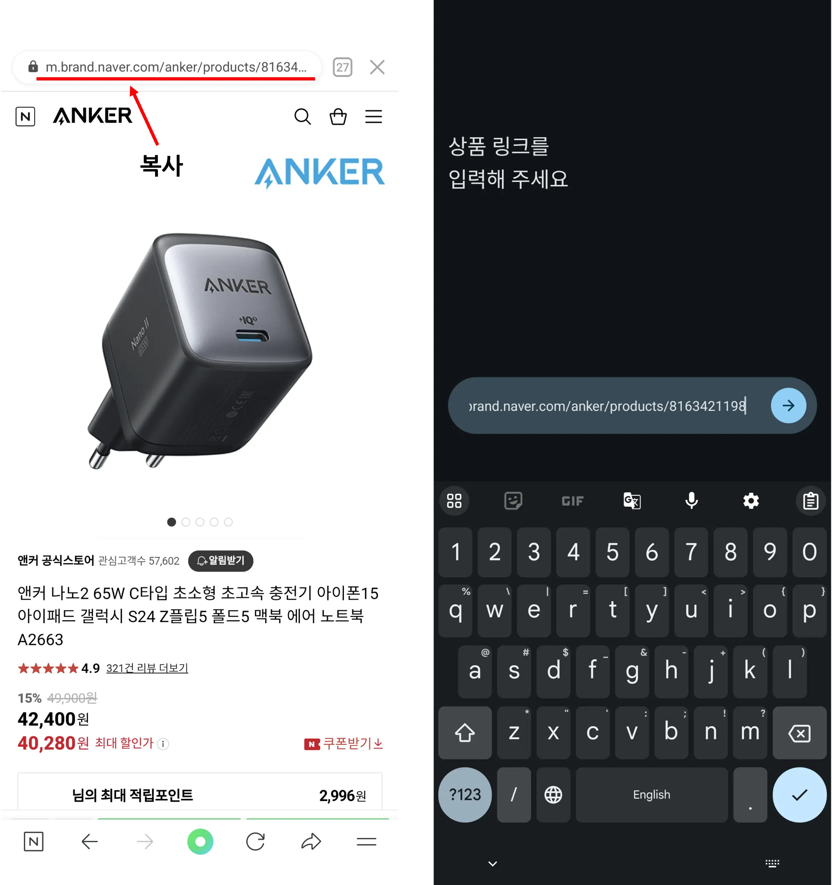

## 상품 등록 방법

#### 현재 11번가와 네이버 스마트스토어를 제외한 다른 쇼핑몰 상품은 등록이 불가능합니다.

#### 네이버 스마트스토어 상품 등록은 앱 버전 1.1.0 부터 사용가능합니다.

### 방법 1. 직접 등록

1. 인터넷 브라우저를 통해 상품 상세 페이지의 링크를 복사합니다.
2. PriceGuard앱을 실행한 뒤 링크 입력 화면에서 붙여넣기 합니다.

### 방법 2. 공유로 등록 (11번가만)

1. 쇼핑몰 앱 상품 화면에서 공유 버튼을 누릅니다.
2. 공유 가능한 앱 목록에서 PriceGuard를 선택합니다.
3. 링크가 자동으로 복사되어 입력됩니다.

